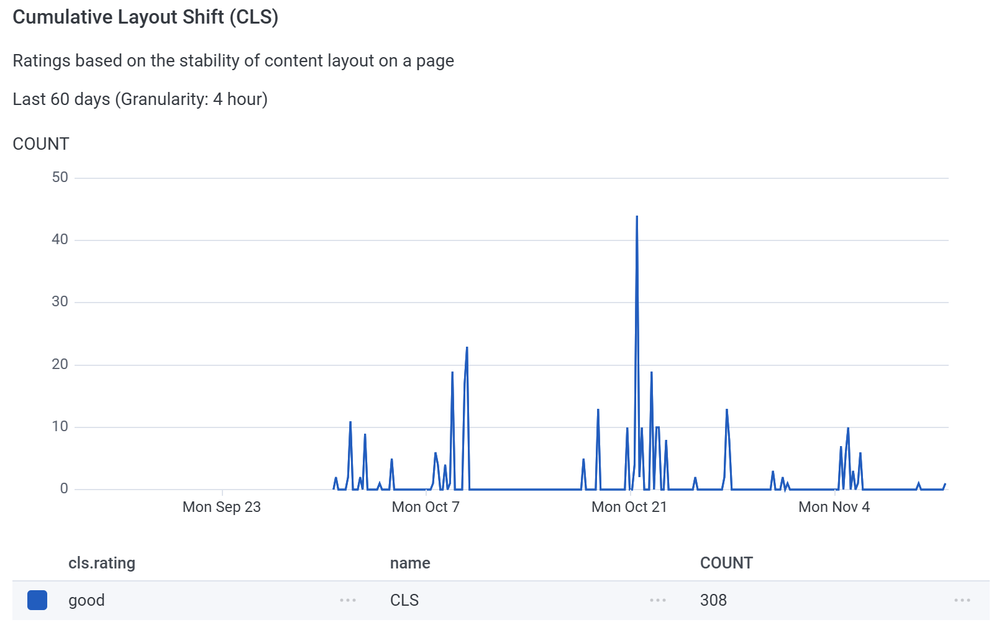

# Getting started

To monitor application performance, Workleap has adopted [Honeycomb](https://www.honeycomb.io/), a tool that helps teams manage and analyze telemetry data from distributed systems. Built on OpenTelemetry, Honeycomb provides a [robust API](https://open-telemetry.github.io/opentelemetry-js/) for tracking frontend telemetry.

Honeycomb's in-house [HoneycombWebSDK](https://docs.honeycomb.io/send-data/javascript-browser/honeycomb-distribution/) includes great default instrumentation. This package provides a slightly altered default instrumentation which is adapted for Workleap's web application observability requirements. 

## Install the packages

First, open a terminal at the root of the application and install the following packages:

+++ pnpm
```bash
pnpm add @workleap/honeycomb @honeycombio/opentelemetry-web @opentelemetry/api @opentelemetry/auto-instrumentations-web
```
+++ yarn
```bash
yarn add @workleap/honeycomb @honeycombio/opentelemetry-web @opentelemetry/api @opentelemetry/auto-instrumentations-web
```
+++ npm
```bash
npm install @workleap/honeycomb @honeycombio/opentelemetry-web @opentelemetry/api @opentelemetry/auto-instrumentations-web
```
+++

!!!warning
While you can use any package manager to develop an application with Squide, it is highly recommended that you use [PNPM](https://pnpm.io/) as the guides has been developed and tested with PNPM.
!!!

## Register instrumentation

Then, update the application bootstrapping code to register Honeycomb instrumentation:

```tsx !#6-8 index.tsx
import { registerHoneycombInstrumentation } from "@workleap/honeycomb";
import { StrictMode } from "react";
import { createRoot } from "react-dom/client";
import { App } from "./App.tsx";

registerHoneycombInstrumentation(runtime, "sample", [/.+/g,], {
    endpoint: "https://sample-collector"
});

const root = createRoot(document.getElementById("root")!);

root.render(
    <StrictMode>
        <App />
    </StrictMode>
);
```

!!!warning
Avoid using `/.+/g,` in production, as it could expose customer data to third parties. Instead, ensure you specify values that accurately matches your application's backend URLs.
!!!

!!!warning
We recommend using an [OpenTelemetry collector](https://docs.honeycomb.io/send-data/opentelemetry/collector/) over an ingestion [API key](https://docs.honeycomb.io/get-started/configure/environments/manage-api-keys/#create-api-key), as API keys can expose Workleap to potential attacks.
!!!

With instrumentation in place, a few traces are now available 👇

### Fetch requests

Individual fetch request performance can be monitored from end to end:

:::align-image-left

:::

### Document load

The loading performance of the DOM can be monitored:

:::align-image-left

:::

### Unmanaged error

When an unmanaged error occurs, it's automatically recorded:

:::align-image-left

:::

### Real User Monitoring (RUM)

The default instrumentation will automatically track the appropriate metrics to display RUM information:

:::align-image-left
{width=536 height=378}
:::
:::align-image-left
{width=536 height=378}
:::
:::align-image-left
{width=532 height=358}
:::

## Set custom user attributes

Most application needs to set custom attributes on traces about the current user environment. To help with that, `@workleap/honeycomb` expose the [setGlobalSpanAttributes](../reference/honeycomb/setGlobalSpanAttributes.md) function.

Update your application bootstrapping code to include the `setGlobalSpanAttributes` function:

TBD
<br />
TBD

Now, every trace recorded after the session initialization will include the custom attribute `app.user_id`:

:::align-image-left
{width=204 height=161}
:::

## Custrom traces

Have a look at the [custom traces](#custrom-traces) page.

## Try it :rocket:

TBD
